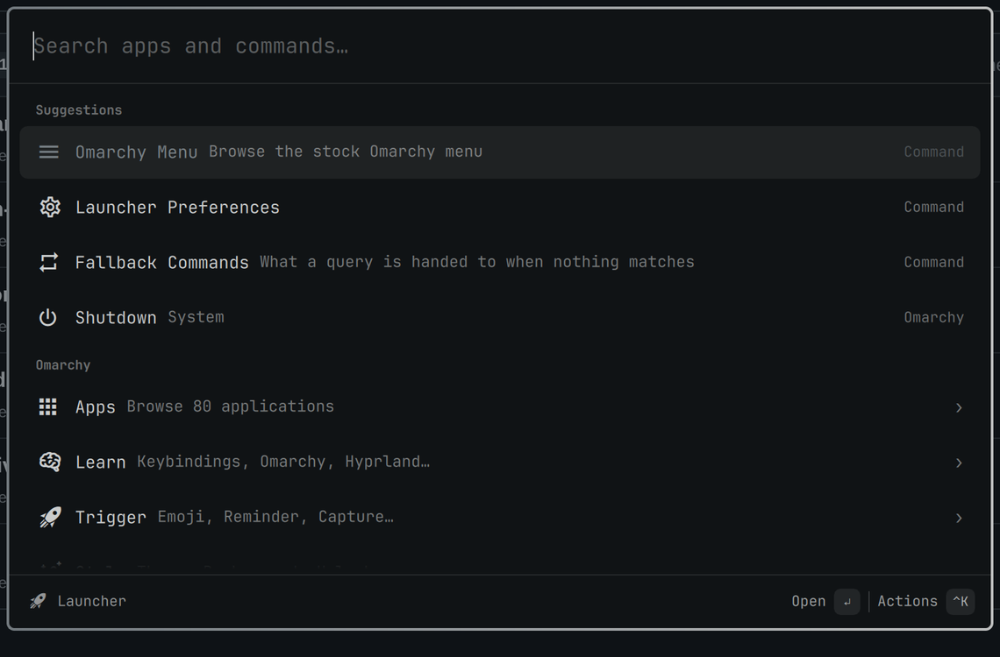

# Omarchy Launcher

A Raycast-style launcher that runs *inside* the Omarchy shell as a native
plugin: one hotkey, one search field, apps and commands ranked by how you use
them, and a keyboard-first UI that follows your Omarchy theme.



## What it does today

- **Root search** over installed applications with the same ranking rules as
  the stock Omarchy menu (prefix › word-boundary › substring › acronym), plus
  usage-based ranking (frecency) so the things you open most float to the top.
- **Suggestions** section when the field is empty, built from your recent use.
- Keyboard model borrowed from Raycast, mapped to Linux modifiers: `↑`/`↓` or
  `Ctrl+P`/`Ctrl+N` move, `Enter` opens, `Tab` autocompletes the top result,
  `Ctrl+U` clears, `Esc` closes.
- Opens on whichever monitor has focus, as a layer-shell overlay with a
  fixed-size card, styled by the `[menu]` tokens of the active theme.
- Bar button (optional) next to the Omarchy menu icon.

The roadmap (calculator, clipboard history, snippets, quicklinks, window
management, system commands, a Raycast-compatible extension runtime, and an
AI layer) is tracked in the repository issues.

## Install

```bash
omarchy plugin add https://github.com/hominluo/omarchy-launcher.git
bash ~/.config/omarchy/plugins/io.github.hominluo.launcher/setup.sh
```

`setup.sh` enables the plugin, creates its config/state directories, and adds
a `SUPER + D` binding to `~/.config/hypr/bindings.lua` inside a marker block
(a timestamped backup of the file is written first). Pick another key with
`--hotkey "SUPER + R"`, or skip the binding with `--no-hotkey` and bind it
yourself:

```lua
o.bind("SUPER + D", "Launcher", "omarchy-shell shell toggle io.github.hominluo.launcher")
```

Enabling puts a bar button next to the Omarchy menu icon. To keep the
launcher without the button, move the entry from `bar.layout` into `plugins`
in `~/.config/omarchy/shell.json`:

```json
"plugins": [{ "id": "io.github.hominluo.launcher" }]
```

## Using it from scripts

```bash
omarchy-shell shell toggle io.github.hominluo.launcher              # toggle
omarchy-shell shell toggle io.github.hominluo.launcher '{"query":"vol"}'
omarchy-shell io.github.hominluo.launcher search "some text"         # open, prefilled
omarchy-shell io.github.hominluo.launcher open "$(printf '%s' '{"query":"a,b"}' | base64 -w0)"
omarchy-shell io.github.hominluo.launcher status
```

Payloads with commas must go through the base64 `open` route: the shell's IPC
splits arguments on commas.

## Files

| Path | Purpose |
|---|---|
| `~/.config/omarchy-launcher/settings.json` | Per-command overrides: `{"commands": {"app:firefox": {"alias": "ff", "favorite": true, "enabled": true}}}` |
| `~/.local/state/omarchy-launcher/frecency.json` | Usage history behind the ranking and the Suggestions section |

Both hot-reload; hand edits apply without restarting the shell.

## Development

```bash
git clone https://github.com/hominluo/omarchy-launcher.git ~/.config/omarchy/plugins/io.github.hominluo.launcher
omarchy-shell shell rescanPlugins
omarchy plugin enable io.github.hominluo.launcher --after omarchy.menu
npm test                      # unit tests for lib/*.js (node --test)
omarchy plugin validate .     # manifest checks the shell enforces
omarchy restart shell         # after QML changes: the window is kept loaded, so hot reload does not re-instantiate it
```

Logs: `journalctl --user -t omarchy-shell -f`.

Layout: `Service.qml` is the headless core (index, ranking, state files, IPC),
`Launcher.qml` owns the window, `ui/` holds the renderers, `lib/` the pure JS
(shared with the tests), `data/` the command catalogs.

## Requirements

Omarchy 4.x (Quickshell shell). Nothing beyond the base install for the
features above.

## License

MIT — see [LICENSE](LICENSE).
