<h1 align="center">Omarchy Launcher</h1>

<p align="center">
  Raycast for <a href="https://omarchy.org">Omarchy</a> — one hotkey, everything on
  your machine, and extensions straight from the Raycast Store.
</p>

<p align="center">
  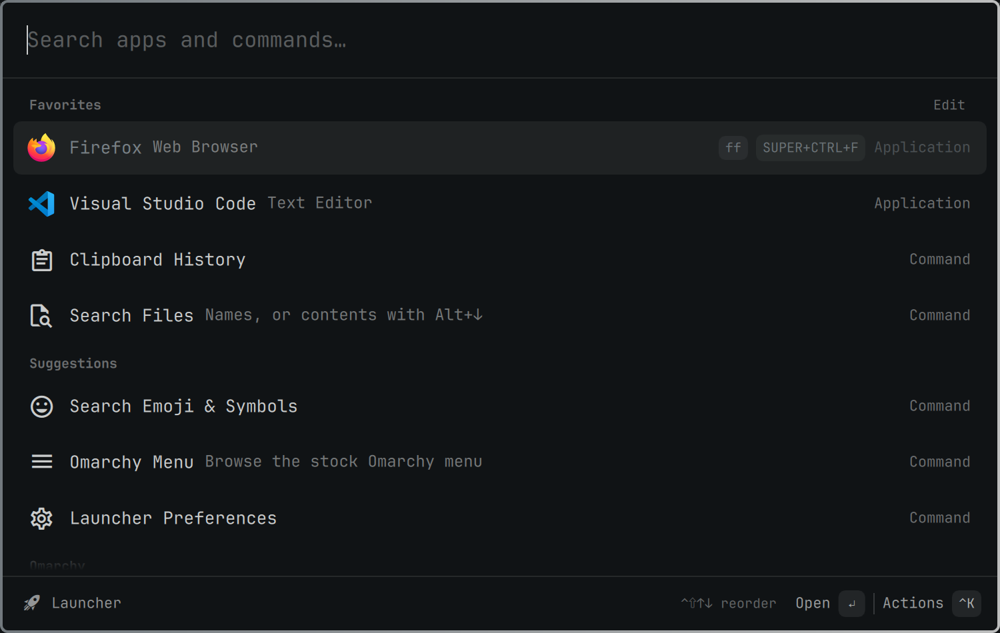
</p>

<p align="center">
  <a href="#install">Install</a> ·
  <a href="#the-default-page">Default page</a> ·
  <a href="#search">Search</a> ·
  <a href="#the-omarchy-menu-inside">Omarchy menu</a> ·
  <a href="#files">Files</a> ·
  <a href="#built-in-commands">Commands</a> ·
  <a href="#raycast-extensions">Extensions</a> ·
  <a href="#keyboard">Keyboard</a> ·
  <a href="#preferences">Preferences</a> ·
  <a href="#scripting">Scripting</a>
</p>

---

A launcher that runs *inside* the Omarchy shell as a native Quickshell
plugin: it follows your theme, opens on the focused monitor, and keeps the
stock Omarchy menu one row away. Applications, commands, quicklinks,
snippets, files, windows, the whole `omarchy-menu.jsonc` tree, script
commands and Raycast extensions rank in one list by how you use them. A
calculator, unit converter, colour and URL rows answer inline. `Ctrl+K` opens
an action panel on every row, and a Node sidecar renders real Raycast Store
extensions natively through the same view model the built-ins use.

## Install

```bash
omarchy plugin add https://github.com/hominluo/omarchy-launcher.git --enable
bash ~/.config/omarchy/plugins/io.github.hominluo.launcher/setup.sh
```

`setup.sh` creates the config and state directories and adds a `SUPER + D`
binding to `~/.config/hypr/bindings.lua` inside a marker block (a timestamped
backup is written first). Pick another key with `--hotkey "SUPER + R"`, change
it later from Launcher Preferences, or skip the binding with `--no-hotkey` and
bind it yourself:

```lua
o.bind("SUPER + D", "Launcher", "omarchy-shell shell toggle io.github.hominluo.launcher")
```

A bar button appears next to the Omarchy menu icon: left click opens the
launcher, right click the stock menu, the tooltip shows the hotkey, and the
icon lights up while the launcher is open. `SUPER + SPACE` and the stock menu
are untouched.

<p align="center"></p>

To keep the launcher without the button, move its entry from `bar.layout` to
`plugins` in `~/.config/omarchy/shell.json`:

```json
"plugins": [{ "id": "io.github.hominluo.launcher" }]
```

Requires Omarchy 4.x with the Quickshell shell. Node.js 22+ only for
extensions (`omarchy pkg add nodejs npm`). Remove it with
`omarchy plugin remove io.github.hominluo.launcher`.

## The default page

An empty search field shows four sections, Raycast's root with the Omarchy
menu folded in:

| Section | What it holds |
|---|---|
| **Favorites** | The rows you pinned with `Ctrl+Shift+F`, in your order (`Ctrl+Shift+↑/↓`). Hidden until you pin something; "Edit" in the header opens Preferences › Favorites. |
| **Suggestions** | Your most-used entries by frecency: at most five, fewer when favorites take the space, so the personal rows stay above the fold. |
| **Omarchy** | The stock menu's root — Apps, Learn, Trigger, Style, Setup, Install, Remove, Update, About, System — each with a preview of its submenu. `Enter` or `→` opens it as a nested list, `Backspace` or `←` comes back. |
| **Commands** | Everything else A–Z with a type label (Application, Command, System, Window, Quicklink, Snippet, Script, AI, or the extension's name). "Install Extensions…" and "Set Up AI…" rows sit here only until you have done so. |

Every row can carry an alias pill, its global hotkey (shown on the cursor
row), a ✓ for toggles that are on, and a type label:

<p align="center">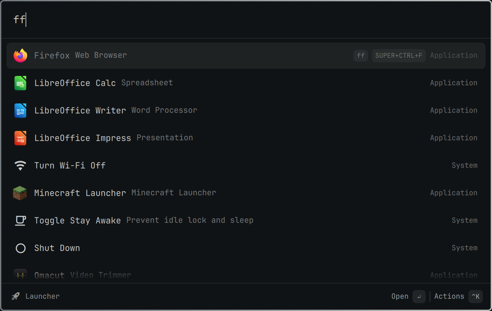</p>

## Search

Typing collapses the page into one ranked list. Ranking follows the stock
menu's rules (prefix › word-boundary › substring › acronym), then aliases,
favorites and usage history. The Omarchy categories answer the stock aliases
(`settings` → Setup, `uninstall` → Remove, `power-menu` → System, exactly like
`omarchy menu summon`), and every leaf carries its breadcrumb.

<p align="center">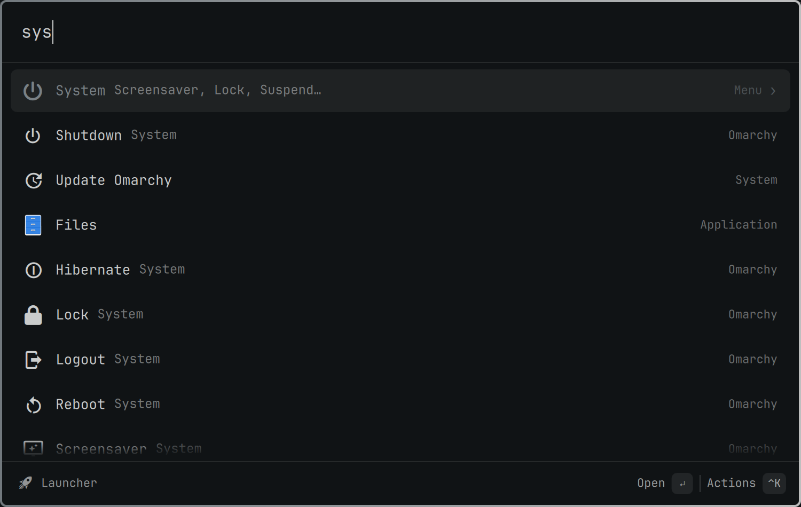</p>

Some things the typed text *is* get an inline row:

| Type this | Get this |
|---|---|
| `2*(3+4)^2 to hex`, `15% of 80`, `ans*2` | The calculator's answer; Enter copies, `Ctrl+Enter` pastes |
| `10 km in mi`, `72f to c`, `1.5 GB in MB` | A unit conversion |
| `#ff8000`, `rgb(255,128,0)`, `hsl(30,100%,50%)` | A colour swatch with HEX / RGB / HSL / QML copies |
| `github.com/raycast/extensions` | Open in Browser, Copy URL, Create Quicklink |
| `~/Doc`, `/usr/sh` | The files and folders there, browsed inline |
| `ff some text` | A quicklink, script or extension command that takes an argument, with the text filled in |

<table>
  <tr>
    <td>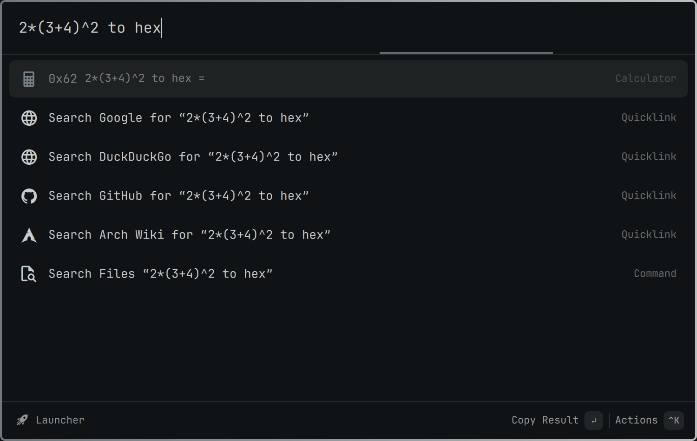</td>
    <td>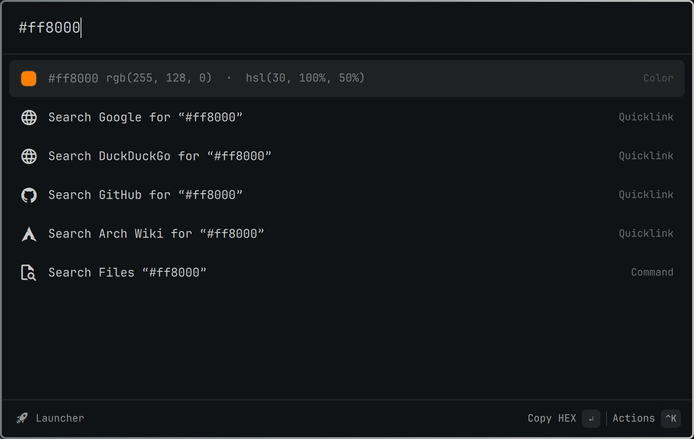</td>
  </tr>
  <tr>
    <td>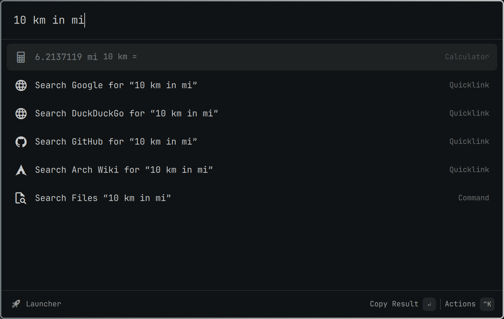</td>
    <td>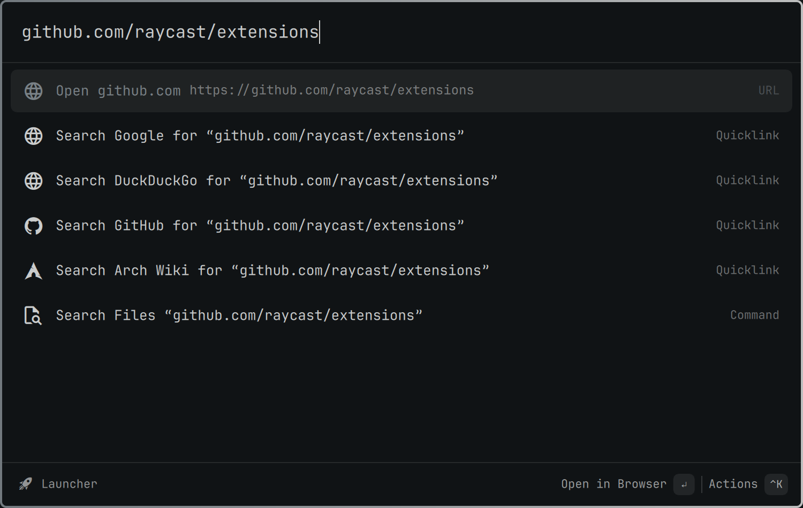</td>
  </tr>
</table>

When nothing matches well, a **Files** section shows the best-ranked files
for the words you typed and the fallback commands (quicklinks with `{query}`,
Search Files, Ask AI, Run Shell Command, Search Snippets, scripts with an
argument) offer to take the query. Pick and order them from "Edit" on the
fallback header or Preferences › Fallback Commands.

## The Omarchy menu, inside

Nothing from the stock menu is lost: every row of `omarchy-menu.jsonc` (the
default tree plus `~/.config/omarchy/extensions/omarchy-menu.jsonc`) is a
launcher entry. Submenus hide when their `when:` guards leave nothing
visible, `checked:` rows show a ✓ and stay open while they toggle, provider
submenus such as Style › Font enumerate live, and typing inside a category
ranks that level and adds an "Inside <Label>" section of everything beneath
it.

<table>
  <tr>
    <td>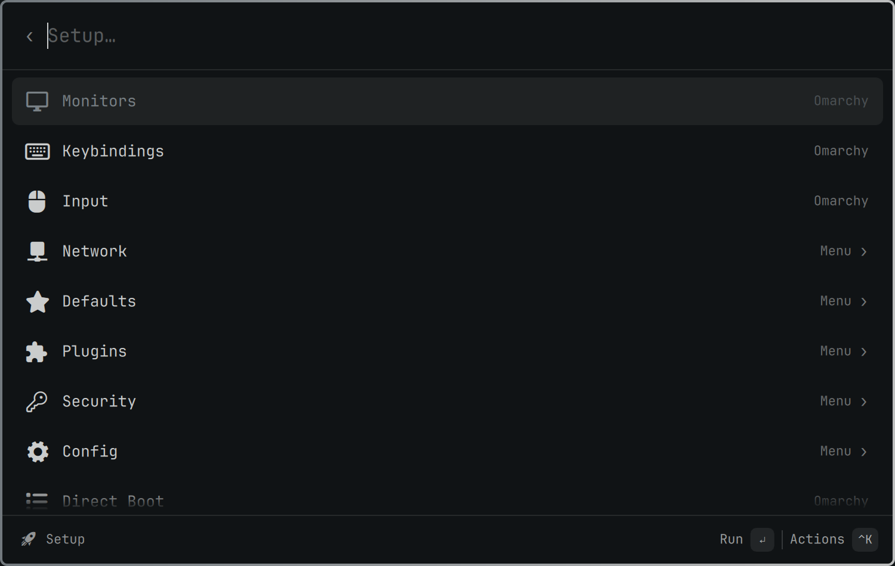</td>
    <td>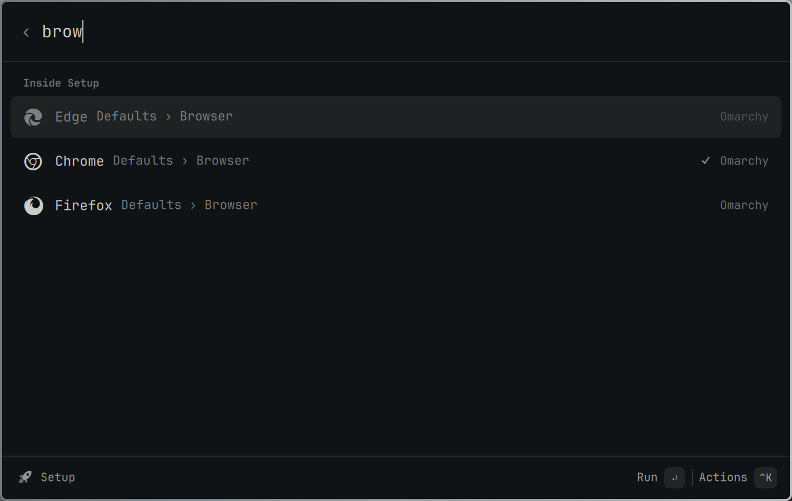</td>
  </tr>
  <tr>
    <td>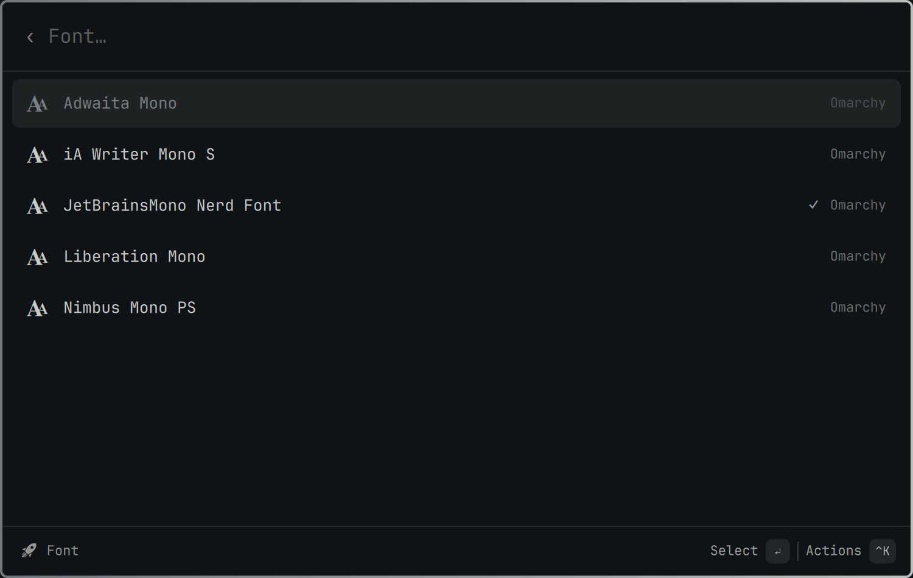</td>
    <td>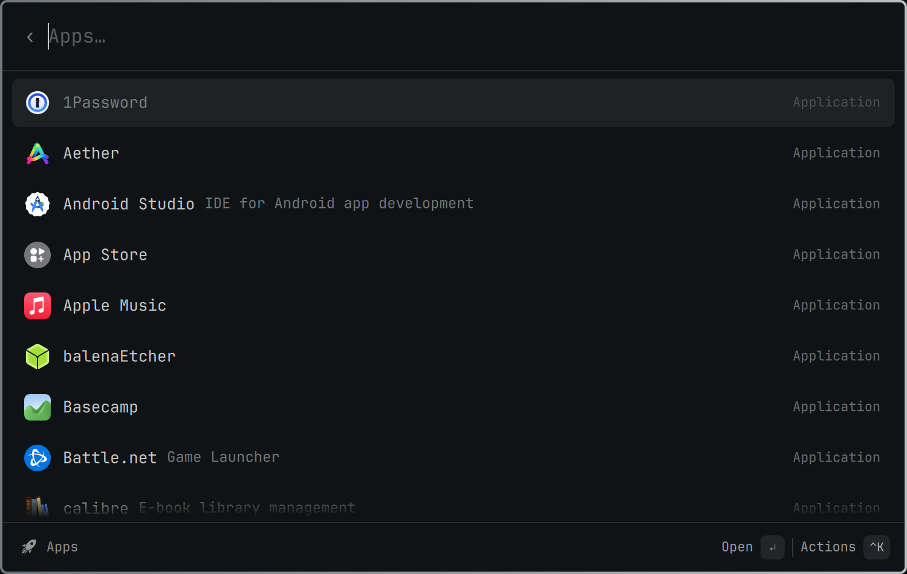</td>
  </tr>
</table>

The Apps category is the launcher's own browser (Recently Used, then A–Z) with
Open, Copy Name, the `.desktop` file's own actions such as "New Private
Window", Hide, and Uninstall (`Delete`) on every row. Power actions ask
before they run. Any category opens directly from a script or a keybinding:

```bash
omarchy-shell io.github.hominluo.launcher menu settings      # id or jsonc alias
omarchy-shell shell toggle io.github.hominluo.launcher '{"menu":"style.font"}'
omarchy-shell shell toggle io.github.hominluo.launcher '{"menu":"setup","query":"brow"}'
```

## Files

Search Files runs `fd` over your home and ranks the candidates for relevance:
exact and prefix names first, project folders over toolchain, cache and SDK
noise, recently modified files up, every word of the query required. The
preview shows type, size and modification time; the empty field lists what
changed this week. Switch the search bar from **File names** to **File
contents** (`Alt+↓`) to run ripgrep and see the matching lines.

<table>
  <tr>
    <td>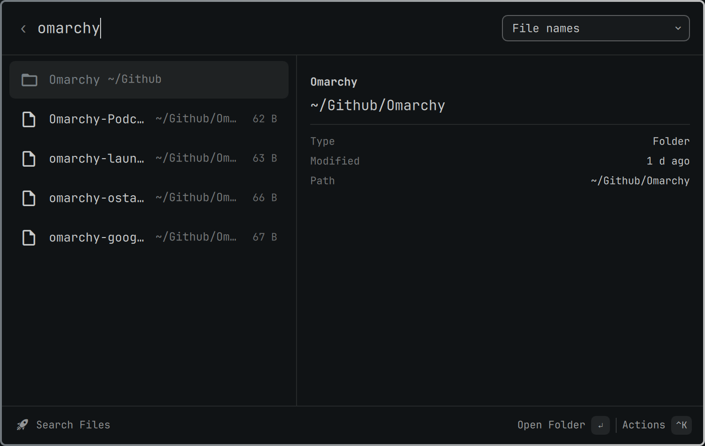</td>
    <td>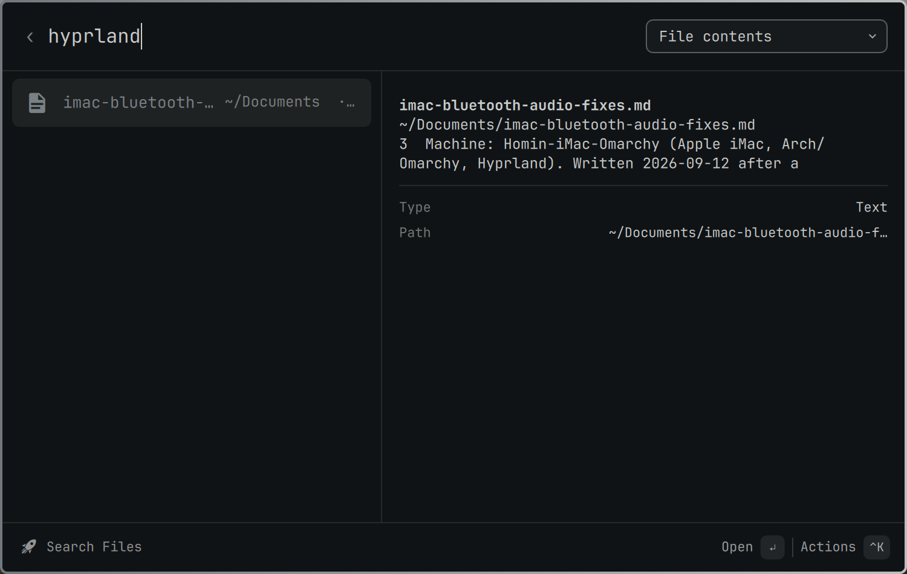</td>
  </tr>
</table>

Actions: Open, Show in File Manager, Open in Terminal, Open in Editor, Copy
Path, Copy File, Move to Trash. Roots, excludes and hidden files are set in
Preferences › File Search; toolchains, caches, SDK sources and Wine prefixes
are skipped by default.

## Built-in commands

Every command can get an alias, a global hotkey, and a favorite flag from
Preferences or the `Ctrl+K` action panel.

| Command | What it does |
|---|---|
| Clipboard History | The shell's own clipboard history with a preview pane, pins, paste / copy / open / delete |
| Search Snippets / Create Snippet | Text snippets with `{clipboard}` `{selection}` `{date}` `{time}` `{uuid}` `{cursor}` `{argument name="x"}` placeholders (arguments without a default are asked for in a form); paste or copy |
| Search Quicklinks / Create Quicklink | URLs with a `{query}` placeholder (Google, GitHub, Arch Wiki, … seeded); also root fallbacks |
| Search Emoji & Symbols | Grid of emoji plus common symbols and kaomoji; recents first |
| Window management | Left/Right/Top/Bottom Half, Thirds, Quarters, Center, Maximize (also Height/Width only), Almost Maximize, Reasonable Size, Restore Previous Size, Move Up/Down/Left/Right, Fullscreen, Tile, Float, Pin, Move to Display, Move to Workspace 1–9 / Next / Previous, Switch to Next/Previous Workspace, Scratchpad (Minimize), Close, Close Others — as individual commands, so each can be bound |
| Switch Windows | Focus, close, float, or pull any open window to the current workspace |
| System | Lock, Sleep, Hibernate, Log Out, Restart, Shut Down, Screensaver, Trash, Show Desktop, Night Light, Do Not Disturb, Stay Awake, Toggle Bar, Crash Capture, Screensaver, Workspace Layout, 1-Window Ratio, Battery Percentage, Touchpad, Touchscreen, Laptop Display, Mirror Display, Hybrid GPU (each toggle shows a ✓ for its current state), volume up/down/mute/set to 0–100%, mic, media keys, brightness, Wi-Fi, Bluetooth, network and disk speed tests, theme and background switching, gaps/transparency toggles, Restart Shell, Update Omarchy, Text Size, Keybindings |
| Kill Process | Live process table sorted by CPU or memory |
| Search Files / Search File Contents | See [Files](#files) |
| Run Shell Command | Enter runs in a floating terminal, `Ctrl+Enter` runs quietly and shows the output |
| Floating Notes / Search Notes / New Note | An always-on-top Markdown notepad that outlives the launcher; notes are files under the state dir |
| Start/Stop Focus Session | Countdown with optional Do Not Disturb, a bar countdown, and a notification at the end |
| Set Reminder / Show Reminders | `omarchy reminder` with a form ("15", "1h", or "14:30") |
| Pick Color / Color History | `hyprpicker`, then HEX/RGB/HSL/QML formats from a grid of swatches |
| Take Screenshot / Screenshot Window / Full Screen, Capture Text (OCR), Scan QR Code, Record Screen | The Omarchy capture tools, reachable without a PRINT key |
| Ask AI / AI commands | Streaming answers and eight text commands (Improve Writing, Fix Spelling, Summarize, Explain, …) through Anthropic, any OpenAI-compatible endpoint, or Ollama — configure a provider in Preferences › AI |
| Omarchy Menu | The stock menu tree, browsable ("Go…"), with its guards, providers, and per-level search |
| Favorites / Fallback Commands | Reorder or remove pinned rows; choose what a query is handed to when nothing matches |
| Launcher Preferences | Hotkey, Default Page, per-command alias/hotkey/favorite/enable, file search, calculator, AI providers, extension preferences |

<table>
  <tr>
    <td>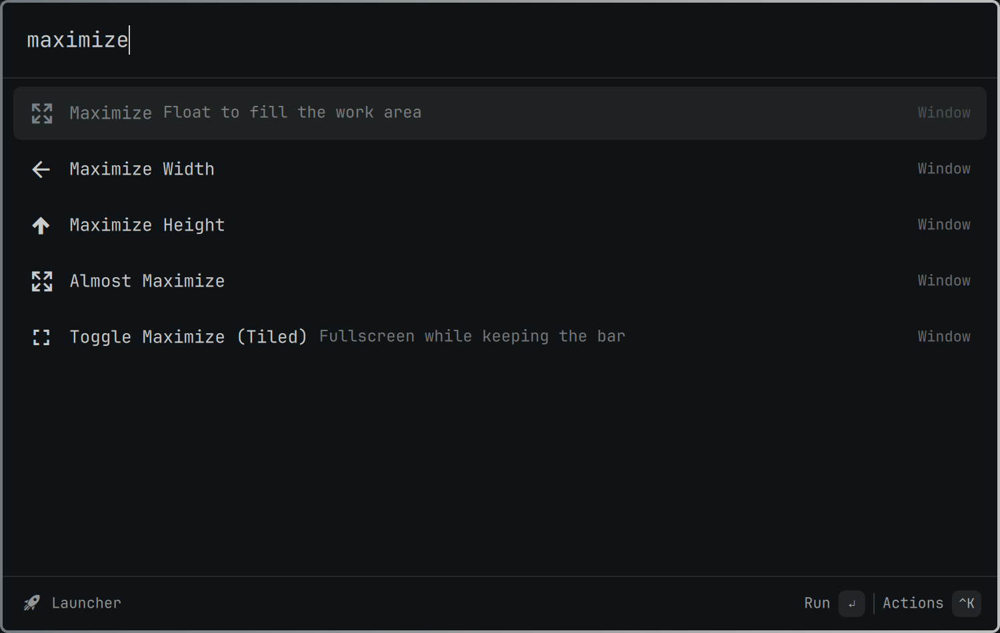</td>
    <td>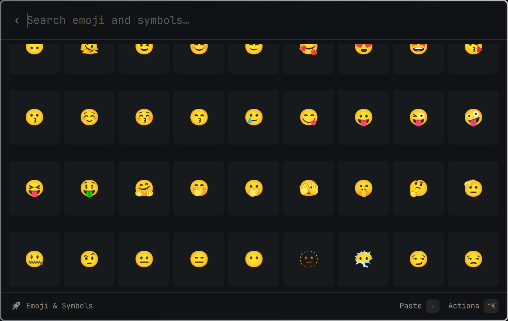</td>
  </tr>
</table>

## Raycast extensions

`launcher ext install <owner/name>` downloads the prebuilt bundle straight
from the Raycast Store (no Node toolchain needed for installs) and its
commands appear in root search. The runtime is a Node sidecar that renders
the extension's React tree natively through the same view model the
built-ins use: lists with sections, accessories and detail panes, grids,
forms, detail pages with metadata, action panels with shortcuts, toasts,
alerts, dropdown accessories, navigation, LocalStorage, Cache, preferences
(with a form for required ones), Clipboard, `open`, OAuth (PKCE with the
`raycast://` redirect), Hyprland-backed WindowManagement, menu-bar commands
(persistent sessions shown as bar buttons), and `AI.ask` through the
configured provider. Commands that declare `arguments` prompt for them in a
form, or take the text after their alias as the first one. Extensions that
call AppleScript or ship macOS binaries are flagged at install time.

<table>
  <tr>
    <td>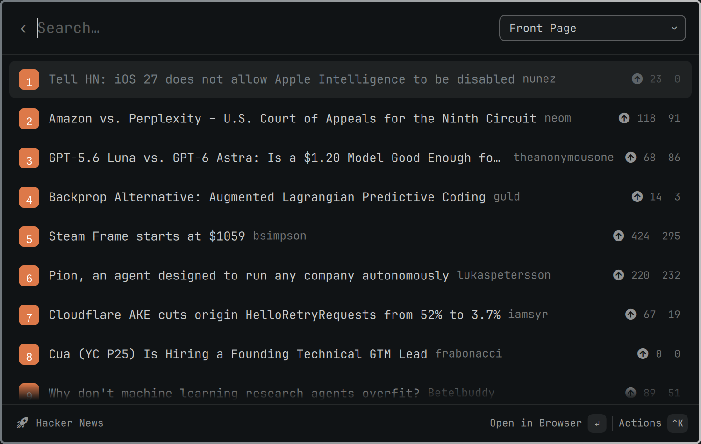</td>
    <td>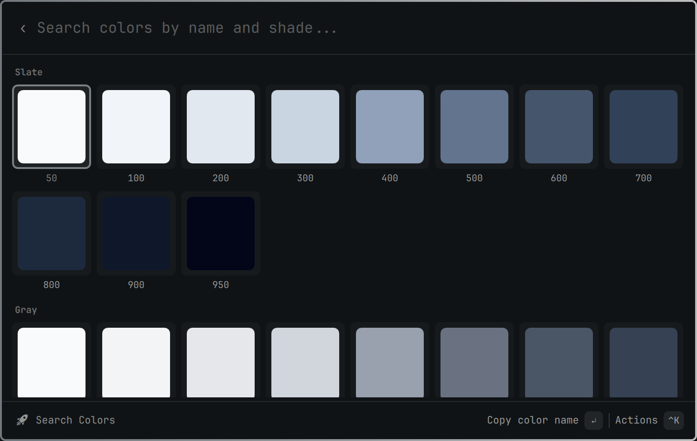</td>
  </tr>
</table>

```bash
launcher ext search github
launcher ext install thomas/hacker-news     # owner/name from the store URL
launcher ext list
launcher ext update                         # every store extension
launcher ext remove thomas/hacker-news
```

Extensions can also be built from source, which needs `npm` (the build uses
the esbuild that ships with `@raycast/api`): a local checkout, any git URL
(`#subdir` optional), or a folder of the official repo, e.g.
`launcher ext install https://github.com/raycast/extensions/tree/main/extensions/hacker-news`.

`launcher` lives in `bin/` of the plugin; add it to your `PATH` or call it by
path. Extensions land in `~/.local/share/omarchy-launcher/extensions/`, their
data in `…/support/`, their preferences in `~/.config/omarchy-launcher/prefs/`.
`raycast://extensions/<owner>/<name>/<command>` deeplinks are handled by
`launcher url <uri>` (`setup.sh` registers it as the `x-scheme-handler` for
`raycast`, `com.raycast` and `omarchy-launcher` links).

## Keyboard

Raycast's ⌘ is Ctrl here.

| Keys | Action |
|---|---|
| `↑` `↓` · `Ctrl+P` `Ctrl+N` | Move |
| `Ctrl+↑` `Ctrl+↓` | Jump between sections |
| `Alt+1` … `Alt+9` | Run the n-th visible row |
| `Enter` · `Ctrl+Enter` · `Ctrl+Shift+Enter` | Primary, second, third action |
| `Ctrl+K` | Action panel |
| `→` · `←` | Open a menu row (or the selected row when the field is empty) · go back |
| `Tab` | Autocomplete the selected row; a second `Tab` runs it |
| `↑` on the first row | Recall earlier queries (`↓` walks forward, `Esc` restores what you typed) |
| `Esc` · `Backspace` on an empty field | Back; at the root, close |
| `Ctrl+U` | Clear the field |
| `Ctrl+Shift+F` · `Ctrl+Shift+↑/↓` | Favorite · reorder favorites |
| `Ctrl+Shift+R` · `Ctrl+Shift+D` | Reset ranking · disable the command |
| `Delete` | Uninstall the selected application (asks first) |
| `Ctrl+Shift+C` | Copy the row's title |
| `Ctrl+,` · `Ctrl+Shift+,` | Preferences · configure the selected command |
| `Alt+↑` `Alt+↓` | Cycle a search-bar dropdown (file names / contents, an extension's filter) |
| `Ctrl+Enter` in a form | Submit |

Per-action shortcuts declared by extensions work with Ctrl in place of ⌘. The
window holds exclusive keyboard focus, so these chords win over Hyprland
binds while it is open.

## Preferences

Launcher Preferences (`Ctrl+,`) covers the hotkey, the Default Page (which
sections show, how many suggestions, the placeholder, search history),
Favorites, Fallback Commands, every command's alias / hotkey / favorite /
enabled flag, file search roots and excludes, the calculator, AI providers,
and each extension's preferences.

<table>
  <tr>
    <td>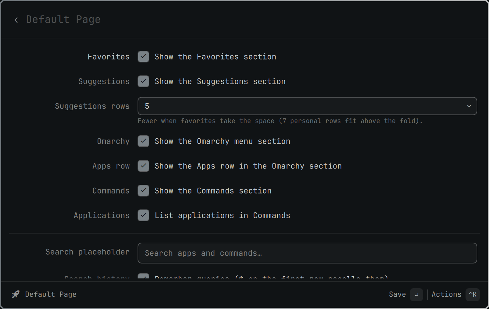</td>
    <td>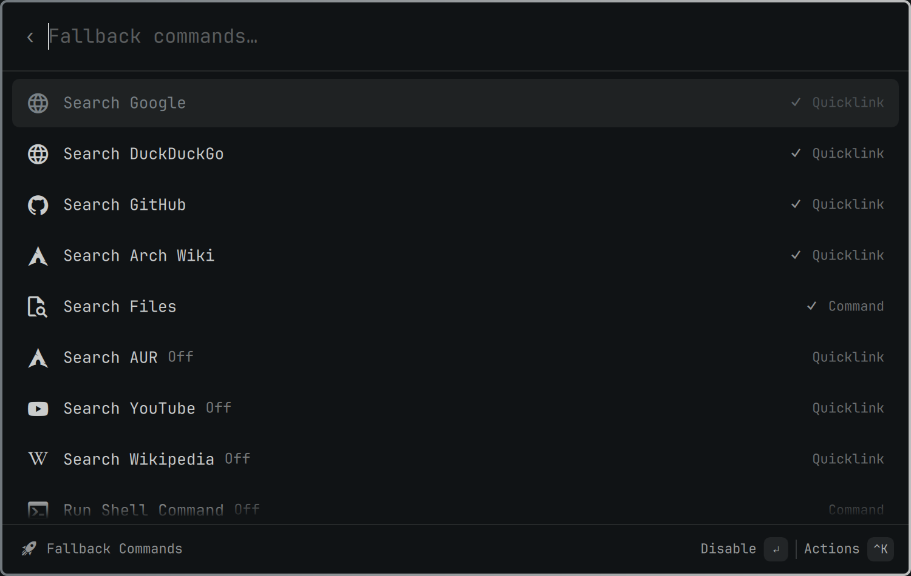</td>
  </tr>
</table>

## Scripting

```bash
omarchy-shell shell toggle io.github.hominluo.launcher              # toggle
omarchy-shell shell toggle io.github.hominluo.launcher '{"query":"vol"}'
omarchy-shell shell toggle io.github.hominluo.launcher '{"command":"clipboard"}'
omarchy-shell io.github.hominluo.launcher run cmd:wm-left-half       # run a command by id
omarchy-shell io.github.hominluo.launcher menu settings              # an Omarchy category by id or alias
omarchy-shell shell toggle io.github.hominluo.launcher '{"menu":"style.font"}'
omarchy-shell io.github.hominluo.launcher open "$(printf '%s' '{"query":"a,b"}' | base64 -w0)"
omarchy-shell io.github.hominluo.launcher status
```

Payloads with commas must go through the base64 `open` route: the shell's IPC
splits arguments on commas. Command ids are visible in Preferences ›
Commands ("Copy Deeplink" in any action panel copies a ready-made call).

### Script Commands

Drop Raycast-format scripts into `~/.config/omarchy-launcher/scripts/` (or add
folders under `scriptDirs` in `settings.json`); `examples/scripts/` has two to
start from:

```bash
#!/bin/bash
# @raycast.schemaVersion 1
# @raycast.title Uptime
# @raycast.mode inline
# @raycast.refreshTime 1m
# @raycast.packageName System
# @raycast.icon ⏱️
uptime -p
```

Modes `silent`, `compact` (toast), `fullOutput` (streamed page), and `inline`
(result shown as the row's subtitle) work; `argument1..3` become a form;
`needsConfirmation` asks first. AppleScript scripts are listed as macOS-only.

## Files

| Path | Purpose |
|---|---|
| `~/.config/omarchy-launcher/settings.json` | `hotkey`, per-command overrides (`commands`), `favoritesOrder`, `fallbackCommands`, `favoritesSection.show`, `suggestionsSection.show`, `suggestionsCap`, `omarchySection.{show,apps}`, `commandsSection.{show,apps}`, `rootPlaceholder`, `searchHistory.enabled`, `fileSearchRoots`, `fileSearchExcludes`, `fileSearchHidden`, `calculator.angle`, `scriptDirs`, `menuBarCommands` |
| `~/.config/omarchy-launcher/{snippets,quicklinks}.json` | Your snippets and quicklinks (edited by the launcher, hand-editable) |
| `~/.config/omarchy-launcher/ai.json` | AI providers (mode 0600) |
| `~/.config/omarchy-launcher/prefs/*.json` | Extension preferences (mode 0600) |
| `~/.local/state/omarchy-launcher/` | Frecency, search history, clipboard pins, notes, colors, focus state, emoji recents |
| `~/.local/share/omarchy-launcher/` | Installed extensions, their support data, OAuth tokens |

Settings, snippets and quicklinks hot-reload; hand edits apply without
restarting the shell.

## Development

```bash
git clone https://github.com/hominluo/omarchy-launcher.git ~/.config/omarchy/plugins/io.github.hominluo.launcher
omarchy-shell shell rescanPlugins
omarchy plugin enable io.github.hominluo.launcher --after omarchy.menu
npm test                      # unit tests for lib/*.js (node --test)
omarchy plugin validate .     # the manifest checks the shell enforces
omarchy restart shell         # after changes to Service.qml, builtins/ or data/; ui/ hot-reloads
```

The extension runtime and the CLI are TypeScript under `packages/`; their
bundles in `runtime/` are committed because the plugin installer never runs
code. Rebuild with `npm run build` in `packages/ext-host` and `packages/cli`
(dependencies install with `bin-links=false` so the plugin folder stays free
of symlinks, which the validator forbids). `packages/ext-host/test/harness.js
<extensionDir> <command>` drives the sidecar without the shell. A hidden
"Dev: Render Fixture" command renders the view-model fixtures in
`tests/fixtures/`.

Logs: `journalctl --user -t omarchy-shell -f` (extension output is prefixed
with the extension id).

Layout: `Service.qml` is the headless core (index, ranking, state files, IPC,
built-ins, extension host), `Launcher.qml` owns the window, `ui/` holds the
renderers, `builtins/` the commands, `lib/` the pure JS shared with the
tests, `data/` the command catalogs and the Raycast-icon glyph map, `ext/`
the sidecar bridge, `bin/` helper scripts.

## Not there yet

- The stock menu's dmenu-style `select`/`input` modes (`omarchy-menu-select`,
  `omarchy-menu-input`) still open the stock menu; scripts call it directly.
  The launcher will accept the same payload
  (`{"mode":"select","prompt":…,"options":[…],"selectionFile":…,"doneFile":…}`)
  once those scripts can be pointed at it.
- Raycast's compact window mode, currency and date arithmetic in the
  calculator, system-wide snippet expansion, and Quick Look.
- AI chat history, Skills, and MCP tools for the AI layer.

## License

MIT — see [LICENSE](LICENSE). Not affiliated with Raycast; "Raycast" and the
extension format belong to Raycast Technologies.
